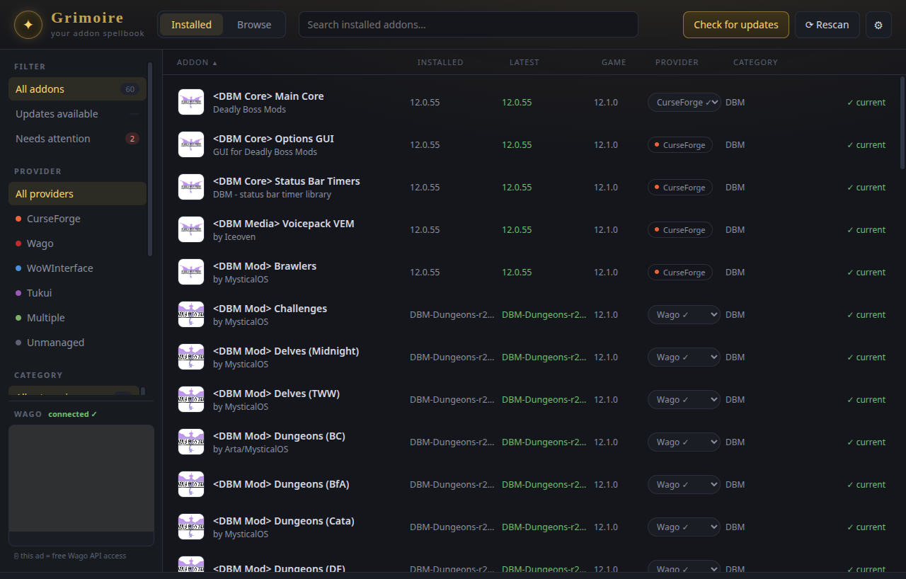
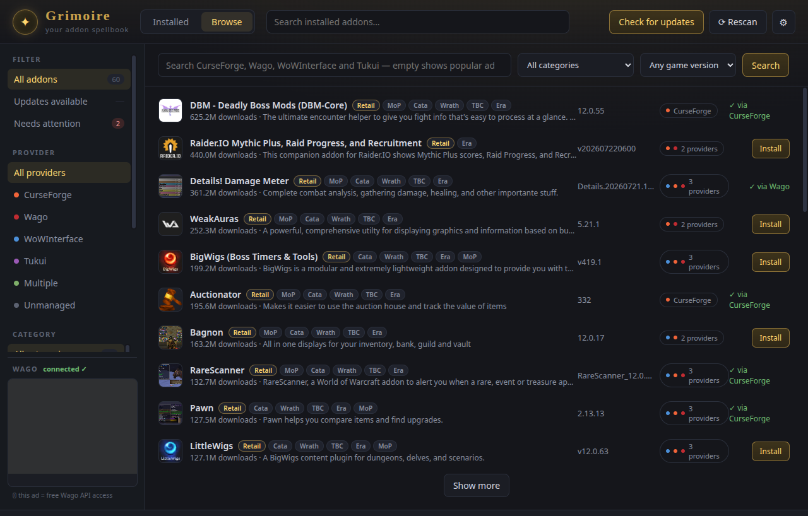
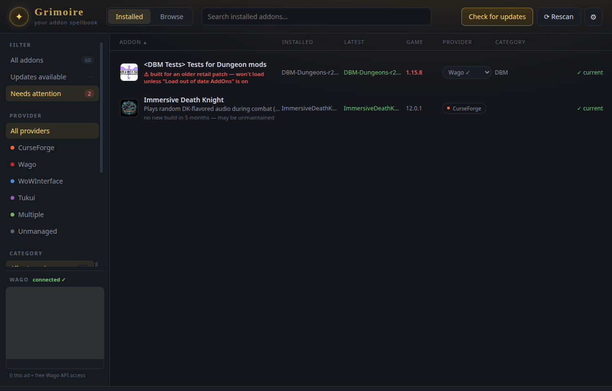

# Grimoire

A World of Warcraft addon manager that handles **CurseForge, Wago, WoWInterface, and Tukui** in one place — because no existing manager covers CurseForge and Wago together.



## Features

- **Auto-detects installed addons** by reading their `.toc` files and install markers — multi-folder addons (BigWigs, ElvUI, Details!) group into a single entry.
- **Cross-provider updates.** Checks each addon against the provider it was installed from and installs updates in place, backing up the old version first.
- **Search and browse** across all four providers at once, with typo tolerance, category filtering, and deep pagination.

  
- **Per-addon provider choice** so CurseForge and Wago never fight over the same addon.
- **Release channels** (stable / beta / alpha) — global default plus per-addon overrides, showing only the channels each addon actually publishes.
- **Provider-health warnings** — flags addons removed from a provider, gone stale, or available fresher elsewhere, with one-click provider switching.
- **Retail API-compatibility detection** — compares each addon's Interface version against your actual installed client (read straight from Blizzard's own `.build.info`) and flags anything that predates the current content patch, checking whether another provider already has a fixed build. CurseForge doesn't reliably mark addons as broken after a patch; this catches it anyway. Judged by content-patch era, not every hotfix, so routine patches don't get flagged.

  
- **Automatic updates** for Grimoire itself via GitHub Releases (Windows and Linux install updates automatically; macOS prompts for a manual download since it isn't code-signed).
- **Version always visible** — shown in the header and in Settings, so you can tell at a glance what you're running.

## Setup

1. Download the latest installer from [Releases](https://github.com/dontshome/grimoire/releases) and run it.
2. On first launch, Grimoire auto-detects your WoW `_retail_` folder (change it in Settings if needed). On Linux, this includes the Battle.net install Lutris's official installer creates (`~/Games/battlenet`), since Battle.net has no native Linux client and always runs through a Wine prefix there.
3. **CurseForge:** paste a free API key from [console.curseforge.com](https://console.curseforge.com) into Settings. This is required — Grimoire only ever talks to CurseForge through their official API, using your own key.
4. **Wago:** connects automatically (no key needed). A Patreon token can be added in Settings if you have one.
5. **WoWInterface / Tukui:** work out of the box, no key.

### Windows

1. Download `Grimoire-Setup-<version>.exe` from [Releases](https://github.com/dontshome/grimoire/releases) and run it.
2. Windows will likely show a blue "Windows protected your PC" screen. This just means Grimoire is a small independent app rather than something from a big company — it's expected and normal. Click **More info**, then **Run anyway**.

### macOS

1. Download `Grimoire-<version>-mac-<arch>.dmg` from [Releases](https://github.com/dontshome/grimoire/releases) — `arm64` if you have an Apple Silicon Mac (M1/M2/M3/M4), `x64` if it's an older Intel Mac.
2. Open the file and drag Grimoire into your Applications folder.
3. The first time, don't just double-click it — instead **right-click (or Control-click) Grimoire in Applications and choose Open**, then click **Open** again in the popup that appears. This step is only needed once. (A plain double-click will refuse to open it with no explanation — right-click → Open is what actually lets you through.)
4. If macOS says Grimoire "is damaged and can't be opened," it isn't really damaged — that's just macOS being extra cautious about apps that aren't from the App Store or a paid developer account. Open the **Terminal** app, paste this line, press Enter, then try opening Grimoire again:
   ```sh
   xattr -cr /Applications/Grimoire.app
   ```

Because Grimoire doesn't have a paid Apple developer certificate, it also can't update itself automatically on Mac the way it does on Windows/Linux — you'll just get a popup with a download link whenever a new version is out.

### Linux

The easiest way — one command installs Grimoire, adds it to your application menu with its icon, and needs no `sudo`:

```sh
curl -fsSL https://raw.githubusercontent.com/dontshome/grimoire/main/install.sh | bash
```

Run that same command again any time to update to the latest version. (As
with any script you pipe into `bash`, feel free to
[read it first](https://github.com/dontshome/grimoire/blob/main/install.sh)
— it only downloads the AppImage and adds a menu entry under your home
directory, nothing else.)

<details>
<summary>Prefer to install by hand instead?</summary>

Grimoire ships as an AppImage — no installer, no package manager needed.

1. Download `Grimoire-<version>-linux-x86_64.AppImage` from [Releases](https://github.com/dontshome/grimoire/releases).
2. Make it executable and run it: `chmod +x Grimoire-*.AppImage && ./Grimoire-*.AppImage`.

   (GNOME's Nautilus file manager won't run an AppImage from a double-click — it's been disabled there since 2018 for security reasons, regardless of file permissions. Use a terminal, or the one-command installer above, which adds a proper menu entry that GNOME's app grid *will* launch.)

That's a working install — nothing else is required. To make it appear in your application menu like a normally-installed program, either:

- Install [AppImageLauncher](https://github.com/TheAssassin/AppImageLauncher) (`sudo dnf install appimagelauncher` on Fedora/Nobara) — it offers to integrate any AppImage the first time you run it, and takes care of everything below automatically.
- Or do it by hand:
  ```sh
  mkdir -p ~/Applications ~/.local/share/applications ~/.local/share/icons/hicolor/512x512/apps
  cp Grimoire-*.AppImage ~/Applications/Grimoire.AppImage
  chmod +x ~/Applications/Grimoire.AppImage
  curl -L -o ~/.local/share/icons/hicolor/512x512/apps/grimoire.png \
    https://raw.githubusercontent.com/dontshome/grimoire/main/build/icon.png
  cat > ~/.local/share/applications/grimoire.desktop <<EOF
  [Desktop Entry]
  Type=Application
  Name=Grimoire
  Comment=World of Warcraft addon manager — CurseForge and Wago in one place
  Exec=$HOME/Applications/Grimoire.AppImage %U
  Icon=grimoire
  Terminal=false
  Categories=Game;
  StartupWMClass=grimoire
  EOF
  update-desktop-database ~/.local/share/applications
  ```
</details>

**Note for Wayland sessions:** Grimoire runs with GPU hardware acceleration disabled when launched under native Wayland (`XDG_SESSION_TYPE=wayland`). This works around a Chromium GPU-process crash seen on some NVIDIA + Wayland setups during Vulkan initialization. Software rendering has no real visual cost for an addon list — X11 sessions, and every other platform, are unaffected and keep full hardware acceleration.

**Note for newer distros (e.g. Ubuntu 24.04+):** some recent distro releases stopped including `libfuse2` by default, which older AppImages need to mount themselves — if Grimoire fails to start with a FUSE-related error, either install it (`sudo apt install libfuse2t64` on Ubuntu) or run the AppImage with `--appimage-extract-and-run` instead, which works without FUSE at all.

## Building from source

```sh
npm install
npm start          # run in development
npm run dist       # build the installer for your OS → dist/
```

`npm run dist` builds whatever electron-builder can produce for the host platform: an NSIS installer on Windows, a dmg/zip on macOS, and an AppImage on Linux. A locally-built installer is unsigned the same way the published releases are — see the platform-specific notes under Setup above for what that means on each OS.

## How it talks to each provider

- **CurseForge** — official API (`api.curseforge.com`) with your own key only. No scraping.
- **Wago** — the public external API (`addons.wago.io/api/external`), the same integration path Wago offers third-party managers.
- **WoWInterface** — public API (`api.mmoui.com`).
- **Tukui** — public API (`api.tukui.org`).

Grimoire never hosts or redistributes any addon. It downloads each addon directly from its provider using that provider's own links, on your behalf.

## Legal & Terms of Use

Grimoire is a free, open-source client for managing World of Warcraft addons. Please read the following before using or distributing it.

**Bring your own credentials.** Grimoire does not include or provide access to any provider's service. To use CurseForge you must supply your own CurseForge API key, obtained directly from CurseForge ([console.curseforge.com](https://console.curseforge.com)). By doing so you agree to CurseForge's and Overwolf's API Terms of Service, and you — not the authors of Grimoire — are responsible for complying with them. The same applies to any Wago, WoWInterface, or Tukui credentials you use. Grimoire acts only as a client that sends requests using the credentials you provide, much like a web browser.

**No addon content is hosted or redistributed.** Grimoire does not store, bundle, mirror, or redistribute any addon. When you install or update an addon, Grimoire downloads it directly from the provider you selected, using that provider's own download links, on your behalf. All addons remain the property of their respective authors and are subject to those authors' and providers' terms.

**Official interfaces only.** Grimoire communicates with each provider through that provider's official or public API. It does not circumvent access controls, rate limits, or authentication.

**No affiliation.** Grimoire is an independent project and is not affiliated with, endorsed by, or sponsored by Blizzard Entertainment, Overwolf, CurseForge, Wago, WoWInterface, or Tukui. World of Warcraft is a trademark of Blizzard Entertainment. All product names, logos, and trademarks are the property of their respective owners and are used for identification purposes only.

**No warranty.** Grimoire is provided "as is", without warranty of any kind, under the MIT License. You use it at your own risk.

## Contributors

- **[dontshome](https://github.com/dontshome)** — author and maintainer.
- **[Blake Burns Technologies Inc.](https://github.com/Blake-Burns-Technologies)** — macOS support and platform testing; cross-volume (EXDEV) install fix; download, archive, and IPC hardening; CurseForge API key validation; keeping credentials out of the renderer process.

## License

[MIT](LICENSE)
